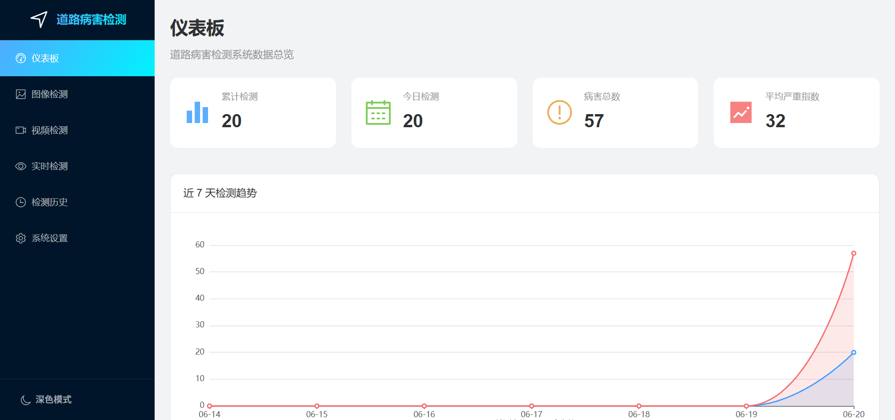

# 道路病害检测系统 v2.0

基于 **YOLO11 + FastAPI + Vue 3** 的现代化道路病害检测系统。

## 项目简介

本系统通过深度学习目标检测模型，实现对道路图像/视频中各种病害（裂缝、坑洞等）的自动识别。采用前后端分离架构，提供优雅流畅的用户界面。



> **v2.0 架构说明**：从 Streamlit 单体应用重构为前后端分离，支持 Docker 容器化部署。原 v1 版本已通过 git tag 归档，可回溯历史。

## 技术栈

### 后端
- **FastAPI** - 高性能异步 Web 框架
- **Ultralytics YOLO11** - 目标检测模型
- **OpenCV** - 图像处理
- **PyTorch** - 深度学习框架
- **SQLAlchemy + SQLite** - 检测记录持久化（异步）
- **ReportLab / openpyxl** - PDF 报告 / Excel 导出

### 前端
- **Vue 3** - 渐进式前端框架（Composition API）
- **TypeScript** - 类型安全
- **Vite** - 构建工具
- **Element Plus** - UI 组件库（含暗色主题）
- **ECharts (vue-echarts)** - 数据可视化
- **Pinia** - 状态管理
- **Vue Router** - 路由管理
- **Axios** - HTTP 客户端

## 数据集

模型训练使用的道路病害数据集来源于 Kaggle：[Road Dataset](https://www.kaggle.com/datasets/ruichaoyi/road-dataset)

包含 5 类常见道路病害标注：
- 纵向裂缝（Longitudinal Crack）
- 横向裂缝（Transverse Crack）
- 块状裂缝（Alligator Crack）
- 坑洼（Pothole）
- 修补区域（Patch）

## 项目结构

```
road-damage-detection/
├── backend/                    # FastAPI 后端
│   ├── api/routes/            # API 路由
│   │   ├── detection.py       # 图像/批量检测
│   │   ├── video.py           # 视频异步检测
│   │   ├── realtime.py        # 实时检测 WebSocket
│   │   ├── records.py         # 历史记录
│   │   ├── stats.py           # 统计分析
│   │   ├── export.py          # PDF/Excel 导出
│   │   └── system.py          # 系统接口
│   ├── core/                  # 核心配置
│   │   ├── config.py          # 应用配置（绝对路径锚定）
│   │   └── database.py        # 异步数据库连接
│   ├── models/                # 模型层
│   │   ├── yolo_model.py      # YOLO 模型管理器
│   │   └── db_models.py       # ORM 数据模型
│   ├── schemas/               # Pydantic 模型
│   ├── services/              # 业务逻辑
│   │   ├── detection_service.py  # 检测 + 加权严重度算法
│   │   ├── record_service.py     # 记录持久化
│   │   ├── stats_service.py      # 统计聚合
│   │   ├── video_service.py      # 视频逐帧处理
│   │   ├── task_manager.py       # 异步任务管理
│   │   └── export_service.py     # 报告导出
│   ├── utils/                 # 工具函数
│   ├── static/results/        # 结果图/视频（运行时生成）
│   ├── road_damage.db         # SQLite 数据库（运行时生成）
│   ├── main.py                # 应用入口
│   ├── run.py                 # 启动脚本
│   └── requirements.txt       # 后端依赖
│
├── frontend/                   # Vue 3 前端
│   ├── src/
│   │   ├── api/               # API 调用封装
│   │   ├── router/            # 路由配置
│   │   ├── stores/            # Pinia 状态（system / theme）
│   │   ├── plugins/           # ECharts 按需注册
│   │   ├── views/             # 页面组件
│   │   ├── App.vue            # 根组件（侧边栏 + 主题切换）
│   │   └── main.ts            # 入口文件
│   ├── package.json
│   └── vite.config.ts
│
├── dataset/                    # YOLO 训练/评估数据集（不入库）
├── Dockerfile                  # 容器镜像构建脚本
├── docker-compose.yml          # 本地 Docker 编排
├── DEPLOY.md                   # 部署文档
└── README.md
```

> 模型权重位于 `backend/weights/`：
> - `road_damage_high_recall.pt` —— 高召回模型（主模型）
> - `road_damage_high_precision.onnx` —— 高精确模型

## 安装与运行

### 环境要求
- Python 3.9+
- Node.js 18+
- npm 9+

### 后端安装

```bash
cd backend
pip install -r requirements.txt
```

### 前端安装

```bash
cd frontend
npm install
```

### 运行

分别在**两个终端**启动后端和前端：

**终端 1 - 后端**：
```bash
cd backend
python run.py
```
后端启动后监听 http://localhost:8000

**终端 2 - 前端**：
```bash
cd frontend
npm run dev
```
前端启动后监听 http://localhost:5173

### 访问地址

- **前端界面**：http://localhost:5173  ← 开发时访问这个地址
- 后端 API 文档：http://localhost:8000/docs
- API 文档：http://localhost:8000/docs

## 功能特性

| 模块 | 功能 | 状态 |
|------|------|------|
| 仪表板 | 真实数据总览、ECharts 趋势/类型/严重度图表、系统状态监控 | ✅ |
| 图像检测 | 单张/批量检测、参数配置、原图-结果图对比展示、结果入库 | ✅ |
| 视频检测 | 异步后台逐帧检测、实时进度条、结果视频在线播放 | ✅ |
| 实时检测 | 浏览器摄像头 + WebSocket 实时推理、累计统计 | ✅ |
| 检测历史 | 分页/筛选/详情抽屉/删除、PDF & Excel 导出 | ✅ |
| 系统设置 | 模型切换、暗色模式 | ✅ |

### 核心优化（相比 v1 Streamlit 版）

- **数据持久化**：所有检测结果入库（SQLite），支持历史回溯与趋势分析
- **加权严重度算法**：综合病害类型权重、置信度、检测框面积占比，输出 0~100 连续指数，比"只数个数"更科学
- **异步视频处理**：长任务后台执行 + 进度轮询，界面不阻塞
- **浏览器摄像头方案**：实时检测不依赖服务器硬件，远程访问也可用
- **结果图存储策略**：单张内联 base64（体验流畅），批量/视频存磁盘返回 URL（避免响应体臃肿）

## API 接口

| 方法 | 路径 | 说明 |
|------|------|------|
| POST | `/api/detection/image` | 单张图片检测 |
| POST | `/api/detection/batch` | 批量图片检测 |
| POST | `/api/detection/video` | 上传视频，启动异步检测任务 |
| GET | `/api/detection/video/task/{id}` | 查询视频任务进度 |
| WS | `/api/detection/ws/realtime` | 实时检测 WebSocket |
| GET | `/api/records` | 历史记录（分页 + 筛选） |
| GET | `/api/records/{id}` | 记录详情 |
| DELETE | `/api/records/{id}` | 删除记录 |
| GET | `/api/stats/overview` | 总览统计 |
| GET | `/api/stats/trend` | 检测趋势 |
| GET | `/api/stats/class-distribution` | 病害类型分布 |
| GET | `/api/stats/severity-distribution` | 严重度分布 |
| GET | `/api/export/pdf/{id}` | 导出 PDF 报告 |
| GET | `/api/export/records.xlsx` | 导出 Excel |
| GET | `/api/system/status` | 系统状态 |
| GET | `/api/system/models` | 可用模型 |
| POST | `/api/system/model/switch` | 切换模型 |

## 检测模型

系统提供两个互补的模型，可在界面中切换：

| 模型 | 格式 | mAP50 | mAP50-95 | 精确率 | 召回率 | 适用场景 |
|------|------|-------|----------|--------|--------|---------|
| 高召回模型（默认） | PyTorch | 0.861 | 0.577 | 0.843 | 0.840 | 普查初筛，尽量不漏检 |
| 高精确模型 | ONNX | 0.858 | 0.550 | 0.865 | 0.811 | 复核确认，减少误报 |

> 指标基于 dataset 测试集（438 张带标注图）实测。两模型类别 ID 映射一致（0~4）。

## 病害类别与严重度权重

| ID | 类别 | 严重度权重 |
|----|------|-----------|
| 0 | 纵向裂缝 | 1.0 |
| 1 | 横向裂缝 | 1.2 |
| 2 | 块状裂缝 | 1.5 |
| 3 | 坑洼 | 2.0 |
| 4 | 修补 | 0.3 |

> 严重指数 = 综合各检测框的 `类型权重 × 置信度 × (1 + 面积占比放大)`，经对数压缩映射到 0~100。
> 等级划分：无病害(0) / 轻微(≤20) / 中等(≤45) / 严重(≤70) / 危险(>70)。

## 后续规划

- [x] 检测结果可视化图片返回（带检测框）
- [x] 检测历史持久化（数据库）
- [x] 优化严重程度评估算法（加权病害指数）
- [x] 统计分析与可视化仪表板
- [x] 视频检测（异步任务 + 进度）
- [x] 实时检测（浏览器摄像头 + WebSocket）
- [x] PDF 报告 / Excel 导出
- [x] 暗色模式
- [x] 双模型分级（高召回 / 高精确）
- [x] Docker 容器化部署（单端口，支持 ModelScope 创空间）
- [ ] 用户认证与权限管理（按需）

## 部署

支持容器化单端口部署（FastAPI 同时托管前端与 API），可本地 Docker 运行或部署到 ModelScope 创空间。详见 [DEPLOY.md](DEPLOY.md)。

```bash
# 本地 Docker 一键运行
docker compose up --build   # 访问 http://localhost:8000
```
